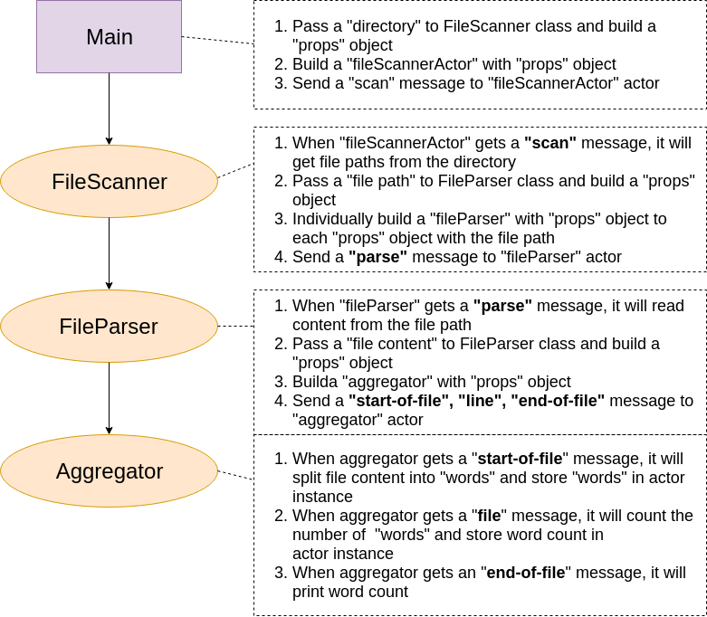

# Java Project

## Installing software requirement & running the project

If you want to install the software requirement in your local environment, please follow the steps:
  * Install
    * Install java8: Please type `make install_java`
    * Install gradle-4.8.1: Please type `make install_gradle`
  * Run
    * Compile the project: Please type `make compile`
    * Run the project: Please type `make run`

If you have docker, I have prepared the `Dockerfile` for this environment:
  * Install
    * Build image: Please type `make build_docker`
    * Run the image as container: Please type `make run_docker`
  * Run
    * Compile the project in docker: Please type `make compile_app`
    * Run the project in docker: Please type `make run_app`
  * Stop & Remove
    * Stop container: Please type `make stop_docker`
    * Remove container: Please type `make rm_docker`

## Architect

My actor hierarchy: mySystem(main) -> fileScanner -> fileParser -> aggregator

Each actor's handler detail has described on the picture.

## Execution Result

## Akka feature

* Processing: Actor is async processing. It doesn't affect caller's thread.
* Storage: Actor can store state in itself and every actor's state is independent.
* Communication: It can use message to communicate between actors.

This project hopes that developer know akka how to work. So, it uses file IO as sample.

Suppose the directory has three file. In general, it needs to
read sequentially each file, the excuting time will occupy the same one CPU slice. If using akka, it can make independent actor and send filepath as message, let every actor can handle one file, it's good to use CPU resource and   can individually process file.
